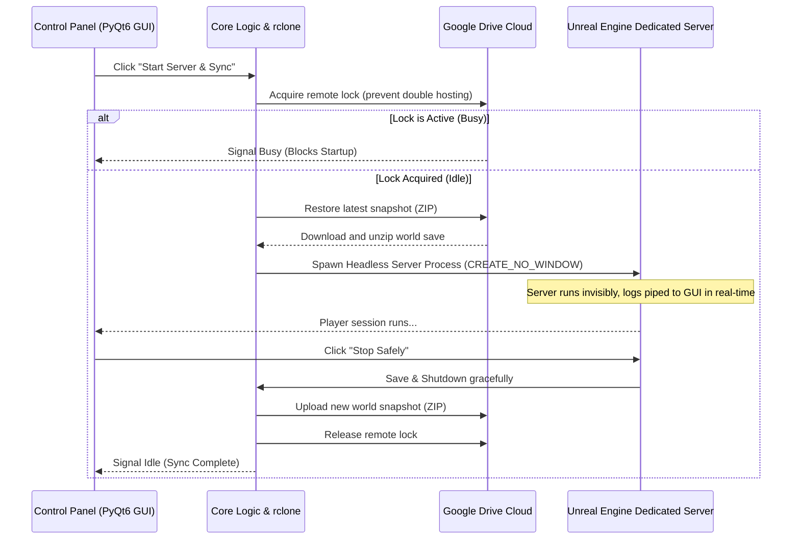

<p align="center">
  
</p>

<h1 align="center">Windrose Sync</h1>

<p align="center">
  <strong>Host Windrose with your friends, one at a time, on any PC — same world, always in sync.</strong>
</p>

<p align="center">
  <a href="#-overview"></a>
  <a href="#-features"></a>
  <a href="#-features"></a>
  <a href="#-quick-start--multiplayer-setup"></a>
</p>

---

## 🌌 Overview

**Windrose Sync** is a professional, high-performance, full-stack automation server-hosting suite for Windrose. It replaces complex manual server management with a stunning, glassmorphic desktop control panel built on **PyQt6** and **Pillow**.

It handles everything natively and silently: remote sync locks, automated world save package packaging (ZIP), Google Drive cloud syncing (via rclone), and fully headless background process spawning.

---

## ✨ Features

* 💎 **Premium Glassmorphic Design:** A state-of-the-art semi-transparent, blurred user interface styled around a rich deep sea abyss and gold theme, with pixel-perfect alpha blending.
* 🛑 **Dedicated Stealth Server Execution:** Runs your Unreal Engine dedicated server in a 100% headless, invisible background process—eliminating annoying empty command console windows.
* 🅰️ **Dynamic Font Bootstrapping:** Automatically downloads and registers **PT Sans** directly from Google Fonts on first boot. Zero local installation required.
* 🎮 **Interactive Game Launching:** Pick your game executable with a native Windows `QFileDialog` on first click, saving it to local configuration for instant future access.
* ☁️ **Dynamic Cloud Directories:** Directly queries `rclone` in non-blocking background threads to retrieve the universal web link to your cloud sync folder.
* 📂 **Native Directory Navigation:** Launches a native Windows File Explorer navigated exactly to your `WindowsServer` directory with a single click.

---

## 🛰️ Architecture & Workflow



---

## 📂 Project Structure

The project has been restructured to separate visual styles and assets into professional subdirectories:

```
windrose-sync/
├── assets/
│   ├── logo.svg              <- Vibrant brand logo (standard HEX vectors)
│   └── windrose_wallpaper.png <- High-resolution background wallpaper
├── core/
│   ├── config.py             <- Dynamic configuration parser & auto-save engine
│   ├── lock.py               <- Cloud-level lock manager (rclone)
│   ├── server.py             <- Invisible subprocess server execution manager
│   └── snapshot.py           <- High-performance compression & sync engine
├── ui/
│   ├── fonts/
│   │   ├── PT_Sans-Web-Regular.ttf <- Google Font (Regular)
│   │   └── PT_Sans-Web-Bold.ttf    <- Google Font (Bold)
│   ├── __init__.py         
│   ├── theme.py              <- Modular QSS stylesheet & Font Bootstrapper
│   └── window.py             <- Glassmorphic Layout & alpha-composition rendering
├── config.json               <- Local configuration parameters (GAME_EXE path)
├── main.py                   <- Application Entrypoint (QApplication bootstrap)
├── cli.py                    <- Full-featured administrative CLI tool
└── requirements.txt          <- Project dependencies
```

---

## 🚀 Quick Start & Multiplayer Setup

### 👑 Part 1: For the Server Creator (The Original Host)

1. **Prerequisites:** Ensure you have **Python 3.10+** installed.
2. **Folder Setup:** Clone or extract this repository.
3. **Install Dependencies:** Open your terminal in the root directory and run:
   ```cmd
   pip install -r requirements.txt
   ```
4. **Launch the App:**
   ```cmd
   python main.py
   ```
5. **First-Time Wizard:** The setup wizard will appear. Click **"Auto-Setup Google Drive"**, authorize your account, and set the Remote Name to `gdrive:WindroseSync`. Click **Save & Continue**.
6. **Create the Cloud Folder:** The app will automatically create a `WindroseSync` folder in your Google Drive root when you first sync.
7. **Share with Friends:** Go to Google Drive in your web browser. Right-click the `WindroseSync` folder and share it with your friends' Google accounts. **CRUCIAL:** You must explicitly change their permission from *Viewer* to **Editor** so they can upload saves!

---

### 🤝 Part 2: For Friends (The Co-Hosts)

1. **Add the Google Drive Shortcut (CRUCIAL):**
   - Open Google Drive in your web browser.
   - Go to the **"Shared with me"** tab on the left.
   - Right-click the shared `WindroseSync` folder.
   - Select **"Organize" > "Add shortcut" > "My Drive"**. *(Without this, rclone cannot sync the files!)*
2. **Folder Setup:** Clone or extract this repository to your PC.
3. **Install Dependencies:** Run `pip install -r requirements.txt` in your terminal.
4. **Launch the App:** Run `python main.py`.
5. **Connect:** When the First-Time Wizard appears, click **"Auto-Setup Google Drive"** and authorize *your own* Google account. Set the Remote Name to `gdrive:WindroseSync`. Click **Save & Continue**.

You are now fully synced! Either of you can click **"Start Server & Sync"** to host the world seamlessly!

---

## 🛠️ Administrative CLI (`cli.py`)

For advanced administrative actions, you can query or unlock the system directly from the command line:

| Command                   | Action                                                           |
| ------------------------- | ---------------------------------------------------------------- |
| `python cli.py status`  | Check current remote lock status before hosting                  |
| `python cli.py unlock`  | Force clear a stuck lock after a system crash                    |
| `python cli.py upload`  | Force compress and upload a snapshot without starting the server |
| `python cli.py restore` | Pull the latest save snapshot without starting the server        |

---

## 📜 Shared-Hosting Rules

1. **One Host at a Time:** The lock engine strictly enforces a single active host. Never attempt to force-unlock if another player is legitimately active.
2. **Graceful Terminations:** Always use **Stop Safely** to close the server. This ensures all player saves are properly flushed, zipped, uploaded, and the lock is clean.
3. **Emergency Recovers:** If a host's machine crashes mid-session, the status stays `Running`. Any player can clear this by clicking **Force Unlock** inside the GUI or running `python cli.py unlock`.

---

## 📄 License

Distributed under the **MIT License**. Free to use, modify, and distribute universally.
